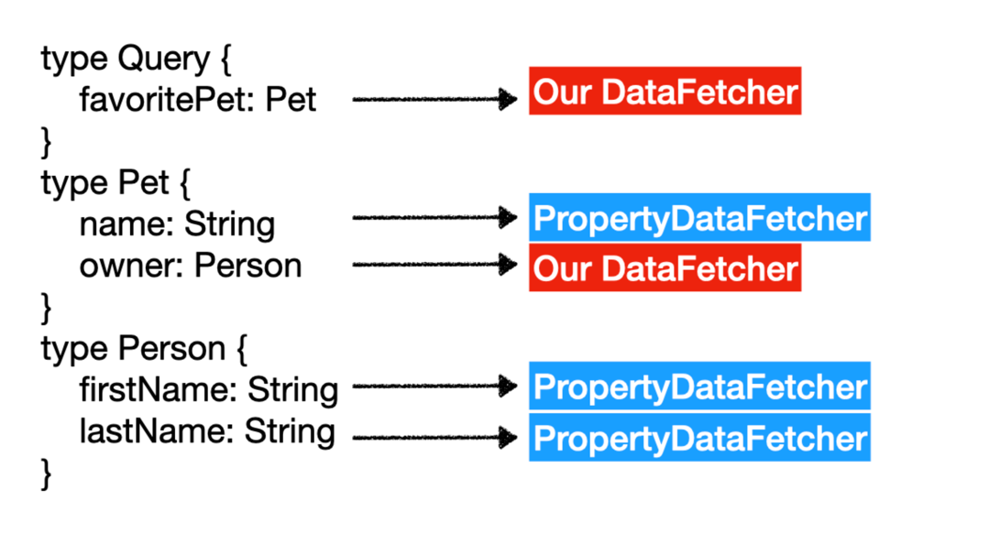

### Learning GraphQL


### Overview & Highlights: 


* GraphQL Java needs to know how to load the data for every field, therefore every field has an associated DataFetcher.
* This field-oriented data loading approach differs from REST, where we implement the logic per endpoint for resources. In GraphQL, there is only one endpoint and data loading happens per field depending on the request. This carries over to Spring controllers, where we map every field DataFetcher to a method in a Controller. This means that Spring for GraphQL controller methods represent a GraphQL field, instead of a REST resource.
* In practice you don't write a DataFetcher for every field. 

* There are four different schema mapping annotations in Spring for GraphQL:
1. the general @SchemaMapping
2. three shortcut anotations: @QueryMapping, @MutationMapping and @SupscriptionMapping


* every field has an associated DataFetcher. However, in the  example below, we have five fields in the schema and only implemented two DataFetchers with controller annotations. 
* While every field has a DataFetcher, we only need to implement a few DataFetchers ourselves. The rest are default DataFetchers that GraphQL Java automatically generates, which are called PropertyDataFetchers.
* Basically you only need to write datafetchers/resolvers for your queries, mutations or subscriptions. the datafetchers for the types are automatically generated by Spring when you add the Type to the schema.graphql file. 
* Well that's not completely true... in the below example:  `type Pet { owner:Person}`  the  author gave an example where he also implemented a DataFetcher for that field. I don't think you have to do that though. Only if you inject custom logic... I think. 
```graphql
type Query { 
    favoritePet: Pet
}
type Pet {
    name: String
    owner: Person
}
type Person { 
     firstName: String
     lastName: String
}
```

